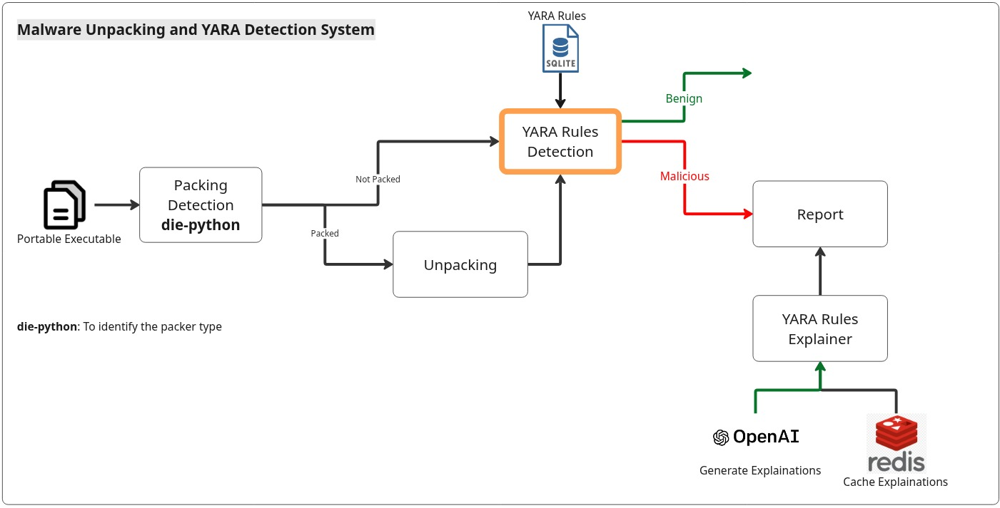

<h1>Design V1.0</h1>



<hr>
<h2>YARA Rules</h2>
<p> Reference: <a href="https://github.com/Neo23x0/signature-base">Neo23x0/Signature_Based</a>
<br/> This repo is the most updated yara rules repo I found
<br/> It currently contains 737 Rules
</p>

<h2>How to Use?</h2>

1. **Clone the repository:**
   ```bash
   git clone https://github.com/MalWhere-CU/Static-Analysis-Engine
   cd Static-Analysis-Engine
2. **Run Setup Script**
    ```bash
    sudo chmod +x setup.sh
    ./setup.sh
---

<h2>Limitations & Future Work</h2>

<p>While this tool effectively handles common packers, advanced malware employs several techniques to thwart automated analysis. Future iterations of this module will aim to address the following challenges:</p>

<details open>
<summary><b>1. Custom Crypters (Signature Evasion)</b></summary>
<p>
    <b>The Challenge:</b> Many threat actors use "private" crypters that lack public signatures. In these cases, <code>die-python</code> will return no results, and generic unpacking stubs may fail.
    <br><br>
    <b>Future Work:</b> Implement <i>OEP (Original Entry Point)</i> detection logic. This involves identifying the "Tail Jump"—the final instruction in a packer stub that transitions execution to the real payload. We plan to integrate <b>Scylla</b>-based dumping to reconstruct the Import Address Table (IAT) once the OEP is reached.
</p>

</details>

<details>
<summary><b>2. Anti-Emulation & Code Virtualization</b></summary>
<p>
    <b>The Challenge:</b> High-end protectors like <b>Themida</b> and <b>VMProtect</b> detect the <i>Unicorn Engine</i> by identifying CPU timing discrepancies or unimplemented obscure instructions. Furthermore, they "virtualize" x86 code into a custom bytecode format.
    <br><br>
    <b>Future Work:</b> Integrate <b>ScyllaHide</b> hooks to mask the emulation environment and explore <b>VTIL (Virtual Tooling Intermediate Language)</b> for static devirtualization of protected code blocks.
</p>
</details>

<details>
<summary><b>3. Language-Specific Bundlers (Python/Go)</b></summary>
<p>
    <b>The Challenge:</b> Tools like <b>PyInstaller</b> don't pack code; they bundle a filesystem. Standard unpacking engines see these as valid, non-packed executables, yet the source remains hidden in <code>.pyc</code> bytecode.
    <br><br>
    <b>Future Work:</b> Add a detection layer for the <code>PYINST</code> signature. If detected, the module will automatically trigger <code>pyinstxtractor</code> and <code>pycdc</code> to recover the original <code>.py</code> source files.
</p>

</details>

<br>


<hr>